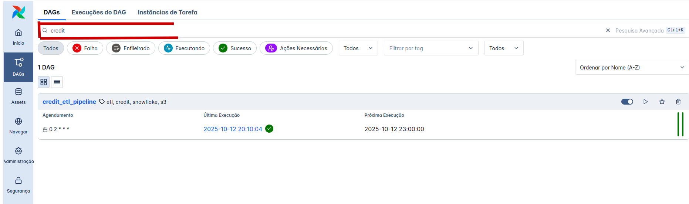
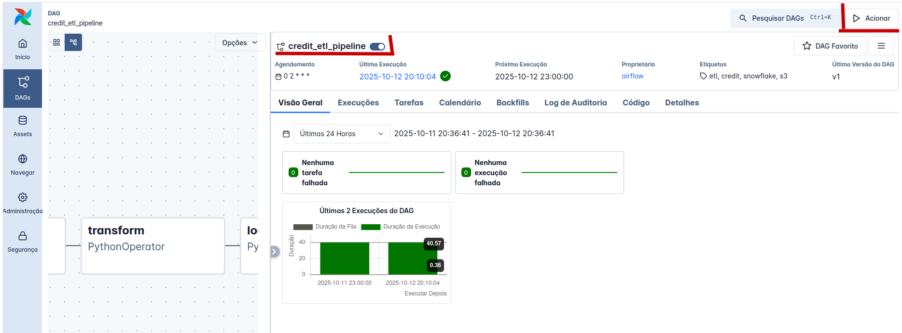
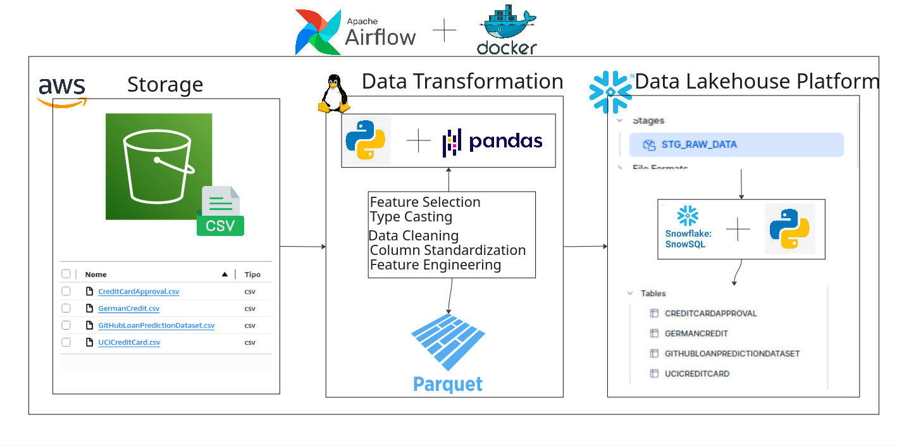

# 📊 Credit Risk ETL Pipeline

Pipeline ETL automatizado para processamento de dados de crédito, orquestrado com Apache Airflow, extraindo dados do AWS S3 e carregando no Snowflake.

---
## 📑 Índice

- [🚀 Como Executar o Pipeline](#-como-executar-o-pipeline)
- [🏗️ Arquitetura](#️-arquitetura)

## 🚀 Como Executar o Pipeline

### **Pré-requisitos**

- Docker & Docker Compose V2 instalados
- Credenciais (nesse caso minhas credenciais serão disponibilizadas para teste)

### **1. Clone o Repositório e Mude Para Ele**

```bash
git clone <HTTPS ou SSH aqui>
cd Desafio_neon
```
### **1.2. Configure as variáves de ambiente ⚠️ **IMPORTANTE**
> **🔴 ATENÇÃO:** Este passo é **obrigatório**! O projeto não funcionará sem as credenciais configuradas.

**Opção 1**
- Você já possui o diretório completo que já vem com o .env

**Opção 2:**
- Você clonou o diretório do github e não possui o .env:
 Então adicione o arquivo .env (enviado por email) no diretório do projeto

🔥 Execute este comando (para ambas opções):
```bash
# Adicione seu UID do sistema
echo "AIRFLOW_UID=$(id -u)" >> .env

```

### **2. Inicie o Airflow**

```bash
# Subir containers
docker compose up -d

# Verificar status
docker compose ps
```
### **4. Acesse a Interface do Airflow**

**Credenciais de acesso:**
| Propriedade | Valor |
|-------------|-------|
| **URL** | http://localhost:8080 |
| **Usuário** | `airflow` |
| **Senha** | `airflow` |

### **5. Execute o Pipeline**

**Na interface do Airflow:**

1. 🔍 Localize a DAG **`credit_etl_pipeline`**


2. ⚡ Ative a DAG (toggle à esquerda)
3. ▶️ Clique em **Trigger DAG** para executar manualmente


> **Ou** aguarde a execução agendada (diariamente às 2h da manhã).

4. Veja os logs de cada uma das tasks na UI do Airflow, (clique na task → Logs)

### **6. Parar o Pipeline**
```bash
# Parar containers
docker compose down

# Parar e remover volumes (limpa tudo)
docker compose down -v
```
## 🏗️ Arquitetura



### Detalhes do Pipeline:

**Tasks:**
1. **extract**: Extrai CSVs do S3 → retorna DataFrames
2. **transform**: Aplica transformações → retorna DataFrames limpos
3. **load**: Salva em Parquet → Upload para Stage → COPY INTO tables

**Comunicação entre tasks:** XCom (Cross-Communication)

**Agendamento:**

- **Frequência:** Diária
- **Horário:** 02:00 UTC
- **Cron:** `0 2 * * *`
- **Catchup:** Desabilitado
- **Retries:** 2 tentativas
- **Retry Delay:** 5 minutos


